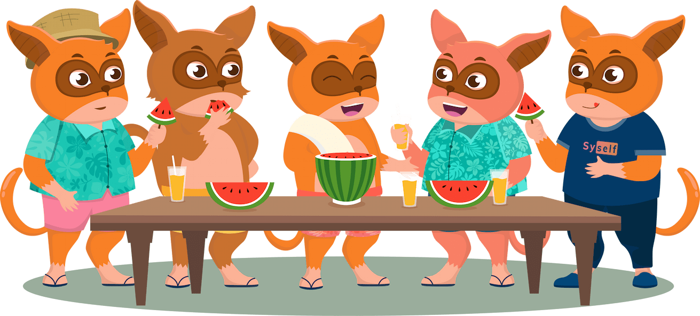

# Syself - UX Engineer role assignment



## Prerequisites

Make sure that you have the following software installed on your machine:

- [Bun](https://bun.sh) - JavaScript runtime
- [git](https://git-scm.com) - distributed version control system
- [Visual Studio Code](https://code.visualstudio.com) - code editor
- [Google Chrome](https://www.google.com/chrome) - web browser

Make sure that you are registered on the following platforms:

- [GitHub](https://github.com) - where the assignment will be submitted.
- [Figma](https://www.figma.com) - where you will work on the design.

## Developing

Once you've installed the dependencies with `bun install`, start a development server:

```bash
bun run dev

# or start the server and open the app in a new browser tab
bun run dev -- --open
```

## Assignment

Design a simple illustration in figma containing abstract UI elements related to a feature of your preference from an imaginary software that manages servers in the cloud. Use the illustration to build a feature section using Svelte and TailwindCSS.

### User Stories

- The section should have, but is not limited to contain: a heading, a description, a cta button and an illustration.
- The copy should not be lorem ipsum, but should be related to the feature you chose. Use your creativity or leverage chatgpt to write the copy (this is not the main focus).
- The section should be styled with TailwindCSS classes.
- The section should be responsive and look good on different screen sizes.
- The illustration should contain simple UI elements that look modern and fresh instead of clumsy and busy.
- The illustration should not contain human or animal characters.
- The illustration should be designed in Figma and exported in `png` format.
- The illustration should be stored in the `/static` folder on this project.
- The section should be built using Svelte, inside of the `/src/routes/+page.svelte` file.
- Do not use any external libraries or frameworks to build the section other than the ones installed on this project.
- Create a new branch and push your code to the repository when you finish.

### Plus

- Follow the Syself brand styles and color palette.

## What we expect from you

There are a few aspects that are very important to us. We will look out for these ones especially:

- You have good communication skills.
- You can work independently and take ownership of your work.
- You can search for solutions on the internet.
- You are not afraid of asking questions if you get stuck, leveraging team collaboration.
- You have a good understanding of Figma and UI/UX design principles.
- You have a good taste for design and can create modern and fresh UI elements.
- You get the details right and can follow a brand style.
- You know the basics of git: you can clone a repository, and create a pull request on GitHub with your changes.

## Scope of the tasks

- We will give you a maximum of 4 hours for this assignment.
- We do not expect you to implement a perfect codebase including responsiveness or accessibility.
- We also don't expect any animations or complex interactions.
- You don't have to do both dark mode and light mode - please pick one.

## Uploading your assignment

To upload your code, you need to create a new branch and push it to the repository:

```bash
# Create a new branch
git checkout -b feature/your-branch-name
# Add your changes
git add .
# Commit your changes
git commit -m "Your commit message"
# Push your changes
git push origin feature/your-branch-name
```

> [!NOTE]
> You can use the VSCode UI to commit and push your changes.

Then, create a pull request on GitHub and assign it to the reviewer.
